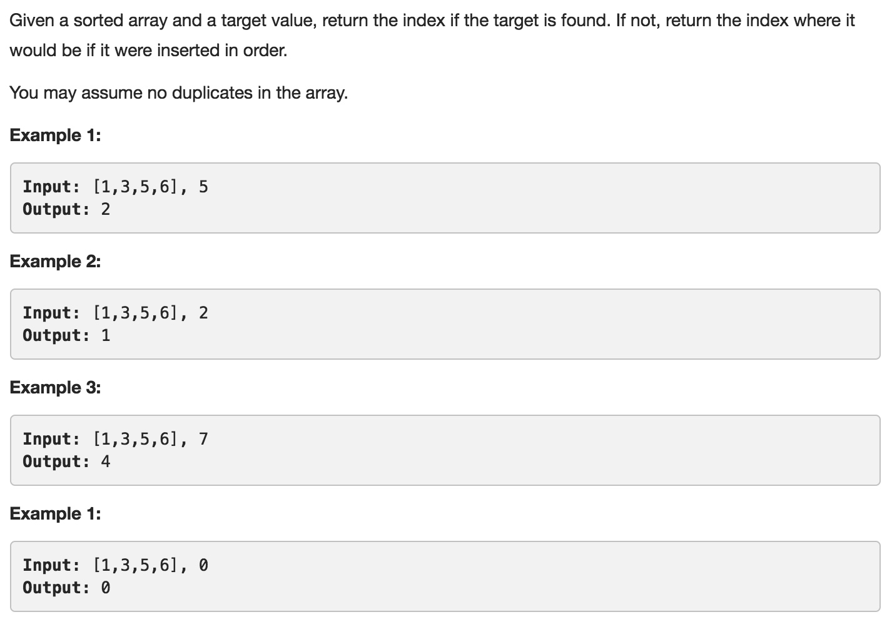

# 035 Search Insert Position
- **Binary Search**+array

## Description


## 1. Thought line


## 2. **Binary Search**+array

```c
class Solution {
private:
    void binarySearchInsert(vector<int>& nums, int target, int st, int ed, int& res){
        if (st>ed) return;
        if (st==ed){
            if (nums[st]<target) res  = st+1;
            if (st==ed && nums[st]>target) res = st;
            if (st==ed && nums[st]==target) res = st;
            return;
        }
        else{
            int mid = (st+ed)/2;
            if (target<=nums[mid])
                binarySearchInsert(nums, target, st, mid, res);
            else
                binarySearchInsert(nums, target, mid+1, ed, res);
        }
    }

public:
    int searchInsert(vector<int>& nums, int target) {
        int res = 0;
        binarySearchInsert(nums, target, 0, nums.size()-1, res);
        return res;
    }
};
```

