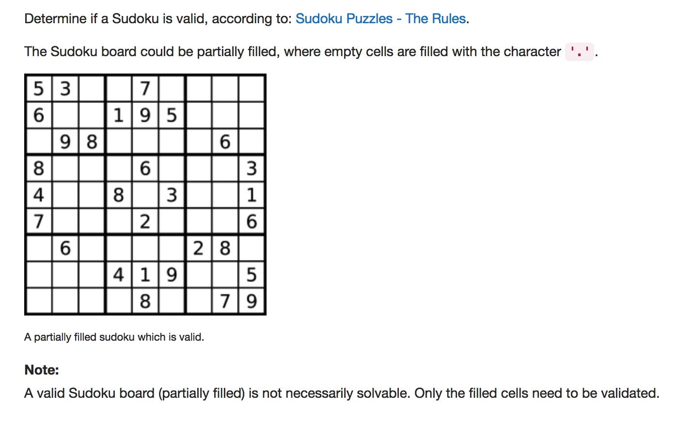

# 036 Valid Sudoku
- **Hash Table**+array

## Description


## 1. Thought line


## 2. **Hash Table**+array

```c
class Solution {
public:
    bool isValidSudoku(vector<vector<char>>& board) {
        bool usedRow[9][9]={false}, usedColumn[9][9]={false}, usedSubBox[9][9]={false};
        
        for (int i = 0; i<=board.size()-1; ++i){
            for (int j = 0; j<=board[i].size()-1; ++j){
                if (board[i][j]!='.'){
                    int num = board[i][j] - '0' - 1;
                    if (usedRow[i][num]||usedColumn[j][num]||usedSubBox[i/3 * 3 + j/3][num])
                        return false;
                    usedRow[i][num] = usedColumn[j][num] = usedSubBox[i/3 *3 + j/3][num] = true;
                }
            }
        }
        return true;
    }
};
```

