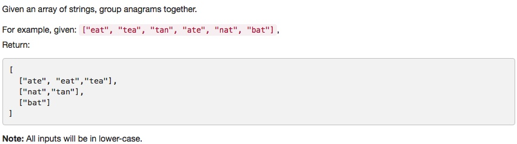

# 049 Group Anagrams
- **Hash Table**+string

## Description


## 1. Thought line


## 2. **Hash Table**+string

```c
class Solution {
public:
    vector<vector<string>> groupAnagrams(vector<string>& strs) {
        map<string, vector<string>> imap;
        vector<vector<string>> result;
        for (int i = 0; i<=strs.size()-1; ++i){
            string temp = strs[i];
            sort(temp.begin(),temp.end());
            imap[temp].push_back(strs[i]);
        }
            
        for (auto it = imap.begin(); it!=imap.end(); ++it){
            string index = it->first;
            result.push_back(imap[index]);
        }
        return result;
    }
};
```

