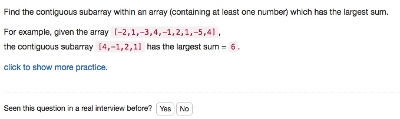

# 053 Maximum Subarray
- **Divide and Conquer**+array
- **Dynamic Programming**+array

## Description


## 1. Thought line


## 2. **Divide and Conquer**+array

```c
class Solution {
private:
    int divideAndConquerMaxSubArray(vector<int>& nums, int st, int ed){
        if (st>ed) return INT_MIN;
        if (st==ed) return nums[st];
        int mid = (st+ed)/2; 
        int lf_maxSubArraySum = divideAndConquerMaxSubArray(nums, st, mid-1);
        int rt_maxSubArraySum = divideAndConquerMaxSubArray(nums, mid+1, ed);
        
        // Calculate the possible result crossing middle point.
        int midToLeft = INT_MIN, midToright = INT_MIN;
        for (int i = mid, sum=0; i>=st; --i){
            sum+=nums[i];
            midToLeft = midToLeft>sum?midToLeft:sum;
        }
        for (int i = mid, sum=0; i<=ed; ++i){
            sum+=nums[i];
            midToright = midToright>sum?midToright:sum;
        }
        int mid_maxSubArraySum = midToLeft+midToright-nums[mid];
        return max(lf_maxSubArraySum,max(rt_maxSubArraySum,mid_maxSubArraySum));
    }

public:
    int maxSubArray(vector<int>& nums) {
        return divideAndConquerMaxSubArray(nums, 0, nums.size()-1);
    }
};
```

