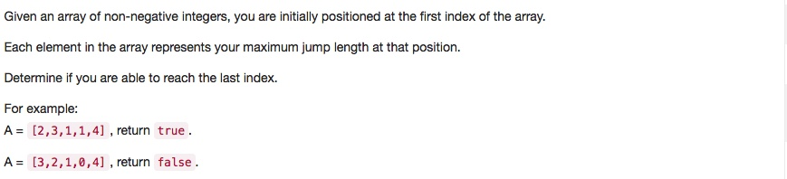

# 055 Jump Game
- **Greedy**+array

## Description


## 1. Thought line


## 2. **Greedy**+array

```c
class Solution {
public:
    bool canJump(vector<int>& nums) {
        int maxRange = 0;
        for(int i=0; i<=maxRange; i++) {
            if (maxRange>=nums.size()-1) return true;
            maxRange = maxRange>i+nums[i]?maxRange:i+nums[i];
        } 
        return false;
    }
};
```

