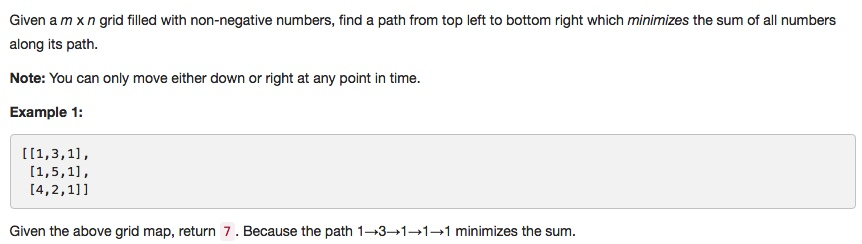

# 064 Minimum Path Sum
- **Dynamic Programming**+Array

## Description


## 1. Thought line


## 2. **Dynamic Programming**+Array

```c
class Solution {
public:
    int minPathSum(vector<vector<int>>& grid) {
        if (grid.empty()) return 0;
        int m = grid.size(), n = grid[0].size();
        for (int i=0; i<=m-1; ++i){
            for (int j=0; j<=n-1; ++j){
                if (i==0 && j==0) continue;
                else if (i==0) grid[i][j] += grid[i][j-1];
                else if (j==0) grid[i][j] +=grid[i-1][j];
                else grid[i][j] += min(grid[i][j-1],grid[i-1][j]);
            }
        }
        return grid[m-1][n-1];
    }
};
```

