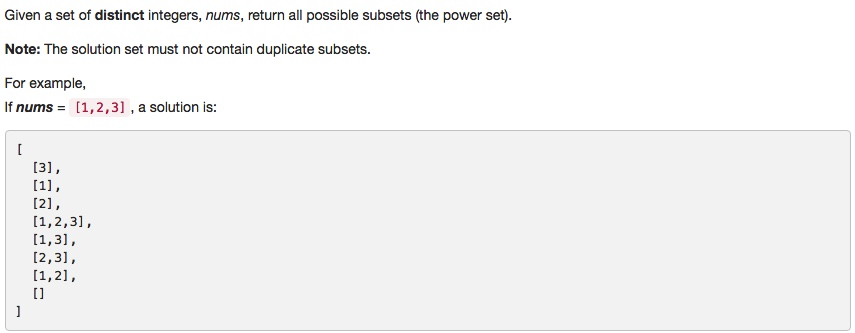

# 078 Subsets
- **Backtracking**
- **Bit Manipulation**

## Description


## 1. Thought line
(1)  When vector<int>& nums.empty(), result should be [ [] ].


## 2. **Backtracking**

```c
class Solution {
private:
    void backtrackingPowerSet(vector<vector<int>>& result, vector<int>& temp, int st, vector<int>& nums){
        // put push action here for corner case_(1)
        result.push_back(temp);
        if (st>nums.size()-1) return;
        for (int i = st; !nums.empty() && i<=nums.size()-1; ++i){
            temp.push_back(nums[i]);
            backtrackingPowerSet(result, temp, i+1, nums);
            temp.pop_back();
        }
    }
public:
    vector<vector<int>> subsets(vector<int>& nums) {
        vector<vector<int>> result;
        vector<int> temp;
        if (nums.empty()) return result;
        backtrackingPowerSet(result, temp, 0, nums);
        return result;
    }
};
```

## 3. **Bit Manipulation**