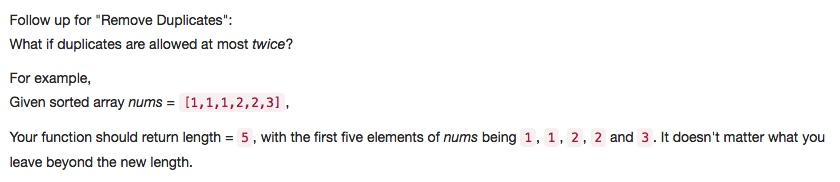
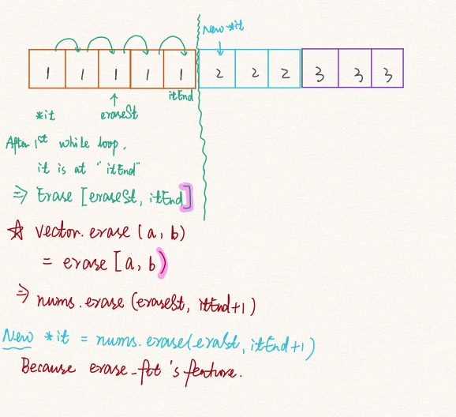

# 080 Remove Duplicates from Sorted Array II
- **Two Pointers**+Array

## Description


## 1. Thought line



## 2. **Two Pointers**+Array

```c
class Solution {
public:
    int removeDuplicates(vector<int>& nums) {
        int result = 0;
        for (auto it = nums.begin(), eraseSt = it; it !=nums.end();  eraseSt = it){
            int duplicateAct = 1;
            while (it +1 !=nums.end() && *(it+1)==*it){
                ++duplicateAct, ++it;
                if (duplicateAct==3) eraseSt = it;
            }
            if (duplicateAct>2) it = nums.erase(eraseSt, it+1);
            else ++it;
            result += duplicateAct<2?duplicateAct:2;
        }
        return result;
    }
};
```

