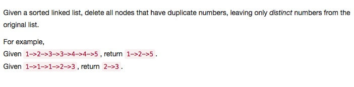
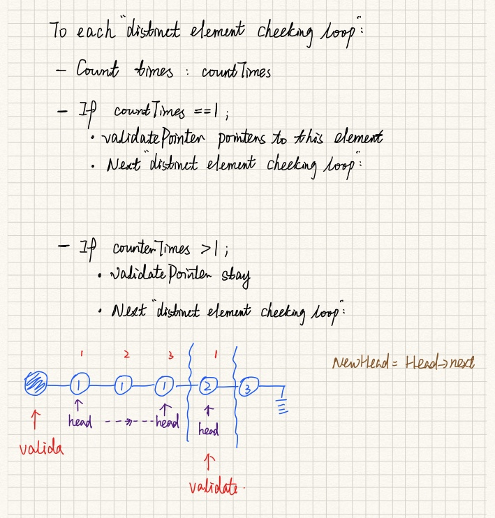

# 082 Remove Duplicates from Sorted List II
- **Linked List**

## Description


## 1. Thought line



## 2. **Linked List**

```c
/**
 * Definition for singly-linked list.
 * struct ListNode {
 *     int val;
 *     ListNode *next;
 *     ListNode(int x) : val(x), next(NULL) {}
 * };
 */
class Solution {
public:
    ListNode* deleteDuplicates(ListNode* head) {
        ListNode* dummyHead = new ListNode(0);
        dummyHead->next = head;
        ListNode* validatedPtr = dummyHead;
        int actElement = 0;
        while(head!=nullptr){
            ++actElement;
            while(head->next!=nullptr && head->next->val == head->val){
                ++actElement;
                head = head->next;
            }
            ListNode* newHead = head->next;
            if (actElement==1){
                validatedPtr->next = head;
                validatedPtr = validatedPtr->next;
            }
            else{
                validatedPtr->next = nullptr;
                head->next = nullptr;
            }
            head = newHead;    
            actElement = 0;
        }
        return dummyHead->next;
    }
};


/**
 * Definition for singly-linked list.
 * struct ListNode {
 *     int val;
 *     ListNode *next;
 *     ListNode(int x) : val(x), next(NULL) {}
 * };
 */
class Solution {
public:
    ListNode* deleteDuplicates(ListNode* head) {
        ListNode* dummyHead = new ListNode(0);
        dummyHead->next = head;
        ListNode* validatedPtr = dummyHead;
        int actElement = 0;
        while(head!=nullptr){
            ++actElement;
            while(head->next!=nullptr && head->next->val == head->val){
                ++actElement;
                head = head->next;
            }
            if (actElement==1){
                validatedPtr->next = head;
                validatedPtr = validatedPtr->next;
            }
            /*
                @_: if actElement >1, validatedPtr doesn't move
                @_: dummyHead list is dominated by dummyHead and validatedPtr ONLY.
                
            */
            head = head->next;    
            actElement = 0;
        }
        validatedPtr->next = nullptr;
        return dummyHead->next;
    }
};
```

