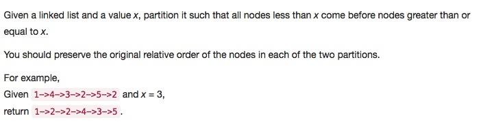

# 086 Partition List
- **Two Pointers** + Linked List

## Description


## 1. Thought line


## 2. **Two Pointers** + Linked List

```c
/**
 * Definition for singly-linked list.
 * struct ListNode {
 *     int val;
 *     ListNode *next;
 *     ListNode(int x) : val(x), next(NULL) {}
 * };
 */
class Solution {
public:
    ListNode* partition(ListNode* head, int x) {
        ListNode* dummyHeadFirstHalf = new ListNode(0);
        ListNode* dummyHeadSecondHalf = new ListNode(0);
        ListNode* firstHalfElement = dummyHeadFirstHalf;
        ListNode* lastHalfElement = dummyHeadSecondHalf;
        
        while(head!=nullptr){
            ListNode* headNext = head->next;
            if(head->val<x){
                firstHalfElement->next = new ListNode(head->val);
                firstHalfElement = firstHalfElement->next;
            }
            else{
                lastHalfElement->next = new ListNode(head->val);
                lastHalfElement = lastHalfElement->next;
            }
            head = headNext;
        }
        firstHalfElement->next = dummyHeadSecondHalf->next;
        return dummyHeadFirstHalf->next;
    }
};
```

