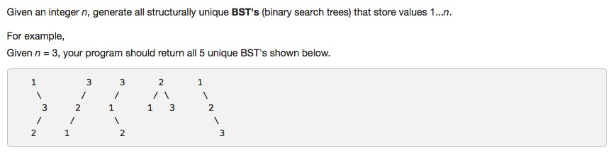
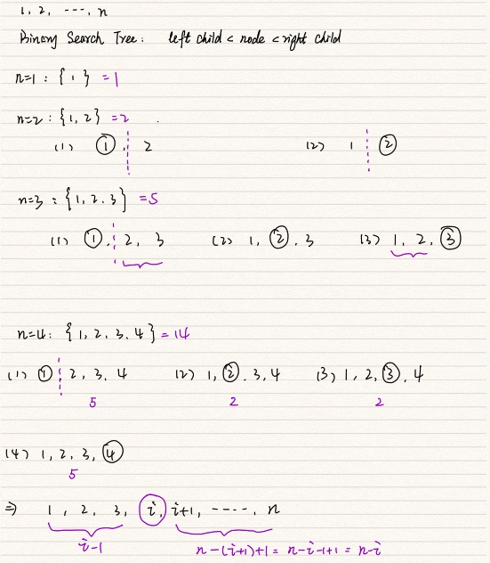

# 096. Unique Binary Search Trees
- **Dynamic Programming** + tree

## Description


## 1. Thought line



## 2. **Dynamic Programming** + tree

```c
class Solution {
public:
    int numTrees(int n) {
        vector<int> uniqueBST(n+1,1);
        
        for (int i=2; i<=n; ++i){
            int uniqueBSTofCurrentNode = 0;
            for (int node = 1; node<=i; ++node){
                int leftNodeNum = node-1, rightNodeNum = i-node;
                uniqueBSTofCurrentNode +=uniqueBST[leftNodeNum]*uniqueBST[rightNodeNum];
            }
            uniqueBST[i] = uniqueBSTofCurrentNode;
        }
        return uniqueBST[n];
    }
};
```

