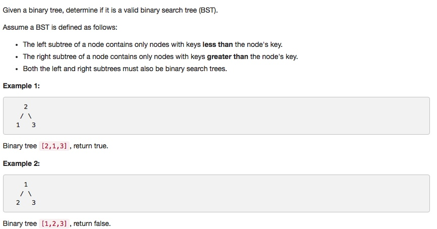

# 098 Validate Binary Search Tree
- **Depth-first Search** + tree

## Description


## 1. Thought line


## 2. **Depth-first Search** + tree

```c
/**
 * Definition for a binary tree node.
 * struct TreeNode {
 *     int val;
 *     TreeNode *left;
 *     TreeNode *right;
 *     TreeNode(int x) : val(x), left(NULL), right(NULL) {}
 * };
 */

class Solution {
private:
    bool isValid(TreeNode* root, long leftBorder, long rightBorder){
        if (root==nullptr) return true;
        int node = root->val;
        if (node<=leftBorder || node>=rightBorder) return false;
        return isValid(root->left, leftBorder,node) && isValid(root->right, node,rightBorder);
    }
public:
    bool isValidBST(TreeNode* root) {
        long leftBorder = LONG_MIN;
        long rightBorder = LONG_MAX;
        return isValid(root, leftBorder,rightBorder);
    }
};
```

