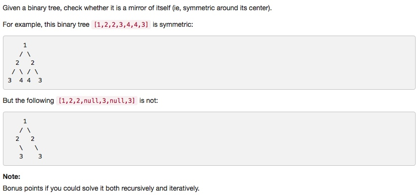

# 101 Symmetric Tree
- **Depth-first Search** + tree
- **Breadth-first Search** + tree

## Description


## 1. Thought line


## 2. **Breadth-first Search** + tree

```c
/**
 * Definition for a binary tree node.
 * struct TreeNode {
 *     int val;
 *     TreeNode *left;
 *     TreeNode *right;
 *     TreeNode(int x) : val(x), left(NULL), right(NULL) {}
 * };
 */
class Solution {
private:
    bool BreadthFirstSearchSymmetric(TreeNode* leftNode, TreeNode* rightNode){
        if (!leftNode && !rightNode) return true;
        if (leftNode && rightNode){
            return ((leftNode->val == rightNode->val) && BreadthFirstSearchSymmetric(leftNode->left, rightNode->right) && BreadthFirstSearchSymmetric(leftNode->right, rightNode->left));
        }
        return false;
    }
public:
    bool isSymmetric(TreeNode* root) {
        if (root==nullptr) return true;
        return BreadthFirstSearchSymmetric(root->left, root->right);
    }
};
```

