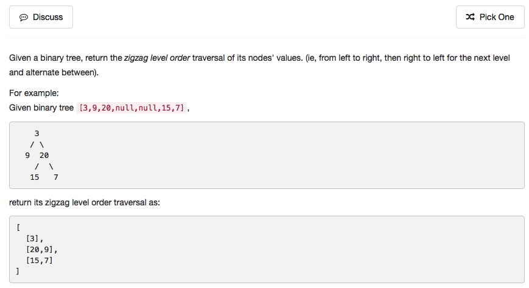

# 103 Binary Tree Zigzag Level Order Traversal
- **Breadth-first Search** + Queue + Tree
- **Breadth-first Search** + Stack + Tree

## Description


## 1. Thought line


## 2. **Breadth-first Search** + Queue + Tree

```c
/**
 * Definition for a binary tree node.
 * struct TreeNode {
 *     int val;
 *     TreeNode *left;
 *     TreeNode *right;
 *     TreeNode(int x) : val(x), left(NULL), right(NULL) {}
 * };
 */
class Solution {
public:
    vector<vector<int>> zigzagLevelOrder(TreeNode* root) {
        vector<vector<int>> result;
        queue<TreeNode*> que;
        if (root!=nullptr) que.emplace(root);
        bool flag = true;
        while (!que.empty() || que.front()!=nullptr){
            queue<TreeNode*> tempQue;
            vector<int> tempVec;
            while (!que.empty()){
                if (flag)
                    tempVec.push_back(que.front()->val);
                else
                    tempVec.insert(tempVec.begin(), que.front()->val);
                if (que.front()->left!=nullptr ) tempQue.push(que.front()->left);
                if (que.front()->right!=nullptr) tempQue.push(que.front()->right);
                que.pop();
            }
            if(!tempVec.empty()) result.push_back(tempVec);
            else break;
            if(!tempQue.empty()) que.swap(tempQue);
            else break;
            flag = !flag;
            
        }
        return result;
    }
};
```

## 3. **Breadth-first Search** + Stack + Tree