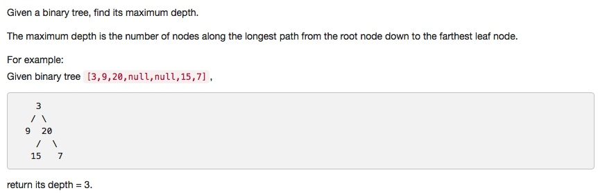

# 104 Maximum Depth of Binary Tree
- **Depth-first Search** + Tree

## Description


## 1. Thought line


## 2. **Depth-first Search** + Tree

```c
/**
 * Definition for a binary tree node.
 * struct TreeNode {
 *     int val;
 *     TreeNode *left;
 *     TreeNode *right;
 *     TreeNode(int x) : val(x), left(NULL), right(NULL) {}
 * };
 */


class Solution {
public:
    int maxDepth(TreeNode* root) {
        if (root==nullptr) return 0;
        return 1+max(maxDepth(root->left),maxDepth(root->right));
    }
};
```