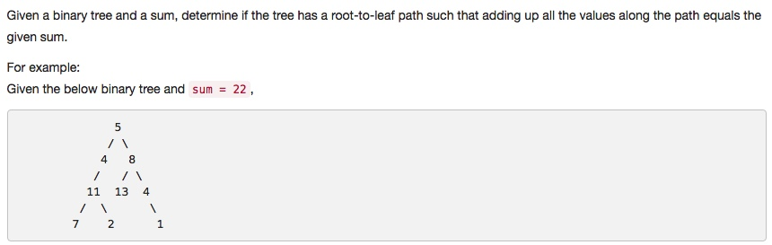

# 112 Path Sum
- **Depth-first Search** + Tree 


## Description


## 1. Thought line

## 2. **Depth-first Search** + Tree

```c
/**
 * Definition for a binary tree node.
 * struct TreeNode {
 *     int val;
 *     TreeNode *left;
 *     TreeNode *right;
 *     TreeNode(int x) : val(x), left(NULL), right(NULL) {}
 * };
 */
class Solution {
private:
    bool DFS_Sum(TreeNode* node, int tempSum, int sum){
        if (node == nullptr) return false;
        tempSum = tempSum + node->val;
        if (node != nullptr && node->left == nullptr && node->right == nullptr && tempSum == sum) return true;
        return DFS_Sum(node->left, tempSum, sum) || DFS_Sum(node->right, tempSum, sum);
    }
public:
    bool hasPathSum(TreeNode* root, int sum) {
        int tempSum = 0;
        return DFS_Sum(root, tempSum, sum);
    }
};
```

```c

```