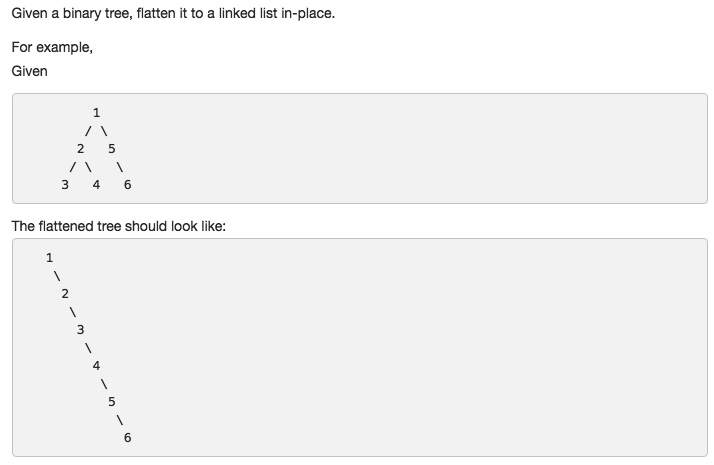

# 114 Flatten Binary Tree to Linked List
- **Depth-first Search** + Tree 


## Description


## 1. Thought line
- ALWAYS move from current node to its right child.
- To each node:
(1) move its right subTree to the most right node of its left subTree.
(2) Switch right subTree and left subTree.
(3) move to next node (node->right)

## 2. **Depth-first Search** + Tree

```c
/**
 * Definition for a binary tree node.
 * struct TreeNode {
 *     int val;
 *     TreeNode *left;
 *     TreeNode *right;
 *     TreeNode(int x) : val(x), left(NULL), right(NULL) {}
 * };
 */
class Solution {
public:
    void flatten(TreeNode* root) {
        while(root!=nullptr){
            TreeNode* leftChild = root->left;
            if (leftChild == nullptr) root = root->right;
            else{
               //move its right subTree to the most right node of its left subTree.
                while (leftChild!=nullptr && leftChild->right!=nullptr) leftChild = leftChild->right;
                leftChild->right = root->right;
                
                //Switch right subTree and left subTree.
                root->right = root->left;
                root->left = nullptr;
                root = root->right; 
            }
        }
    }
};
```

```c

```