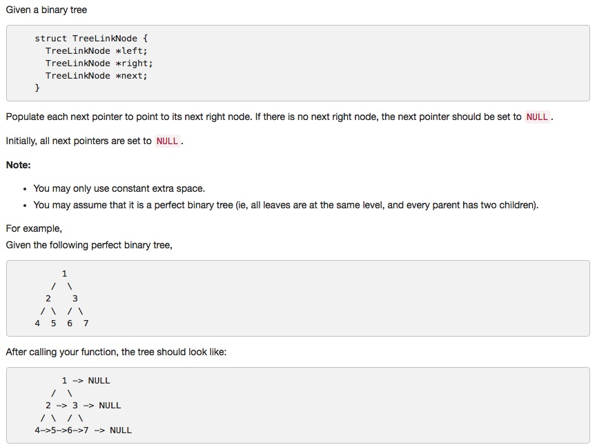

# 116 Populating Next Right Pointers in Each Node
- **Depth-first Search** + Tree 


## Description


## 1. Thought line

## 2. **Depth-first Search** + Tree

```c
/**
 * Definition for binary tree with next pointer.
 * struct TreeLinkNode {
 *  int val;
 *  TreeLinkNode *left, *right, *next;
 *  TreeLinkNode(int x) : val(x), left(NULL), right(NULL), next(NULL) {}
 * };
 */
class Solution {
private:
    void connect_fct(TreeLinkNode *node, TreeLinkNode *nodeNext) {
        if(node == nullptr) return;
        node->next = nodeNext;
        connect_fct(node->left, node->right);
        connect_fct(node->right, (nodeNext==nullptr)?nullptr:nodeNext->left);
        
    }
public:
    void connect(TreeLinkNode *root) {
        connect_fct(root, nullptr);
    }
};
```

```c

```