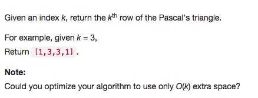
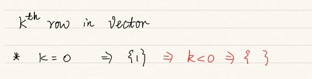

# 119 Pascal's Triangle II
- array
 

## Description


## 1. Thought line


## 2. array

```c
class Solution {
public:
    vector<int> getRow(int rowIndex) {
        if (rowIndex<0) return {};
        if (rowIndex==0) return {1};
        vector<int> preLine = {1};

        for (int i=1; i<=rowIndex; ++i){
            vector<int> result;
            for (int j=0; j<=i; ++j){
                int upLineSize = i; // [0, upLineSize-1]
                int lfElementUpLine = (i-1>=0 && j-1>=0)? preLine[j-1]:0;
                int rtElementUpLine = (i-1>=0 && j<=i-1)? preLine[j]:0; 
                result.push_back(lfElementUpLine+rtElementUpLine);
            }
            preLine = result;
        }
        return preLine;
    }
};
```