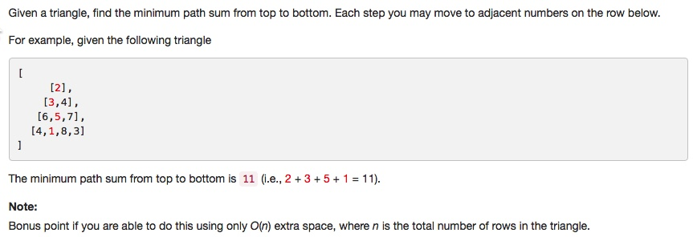
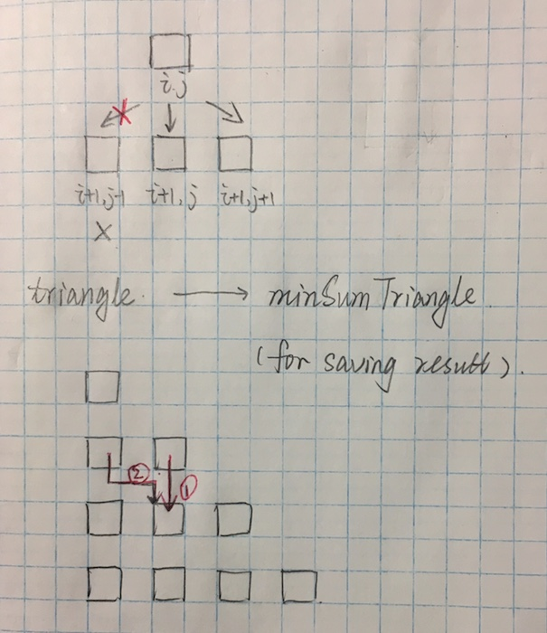

# 120 Triangle
- **Dynamic Programming** + array
 

## Description


## 1. Thought line

## 2. Dynamic Programming+ array

```c
class Solution {
public:
    int minimumTotal(vector<vector<int>>& triangle) {
        if (triangle.empty()) return 0;
        for (int i = 1; i<=triangle.size()-1; ++i){
            for (int j = 0; j<=i; ++j){
                int a = (i-1>=0 && j-1>=0) ? triangle[i][j] + triangle[i-1][j-1] : INT_MAX;
                int b = (i-1>=0 && j<=i-1) ? triangle[i][j] + triangle[i-1][j] : INT_MAX;
                triangle[i][j] = a<b ? a : b;
            }
        }
        sort(triangle[triangle.size()-1].begin(), triangle[triangle.size()-1].end());
        return triangle[triangle.size()-1][0];
    }
};
```