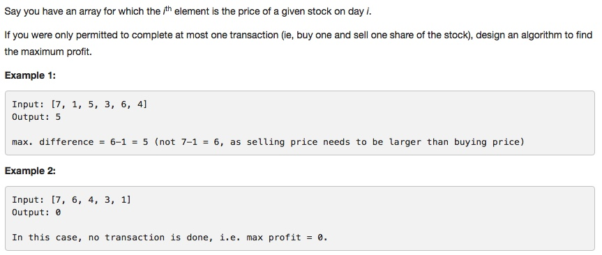

# 121 Best Time to Buy and Sell Stock
- **Dynamic Programming** + array
 

## Description


## 1. Thought line
- buy is always before sell
- looking for the minimum of buy price
- looking for the maximum of sell price

## 2. Dynamic Programming + array

```c
class Solution {
public:
    int maxProfit(vector<int>& prices) {
        if (prices.size() <= 1) return 0;
        int result = 0, buy = prices[0];
        for (int i = 1; i <= prices.size()-1; ++i){
            // possible to buy
            if (prices[i] < buy) buy = prices[i];
            // possible to sell (sell after buy)
            else result = (prices[i]-buy > result)?prices[i]-buy:result;
        }
        return result;
    }
};
```